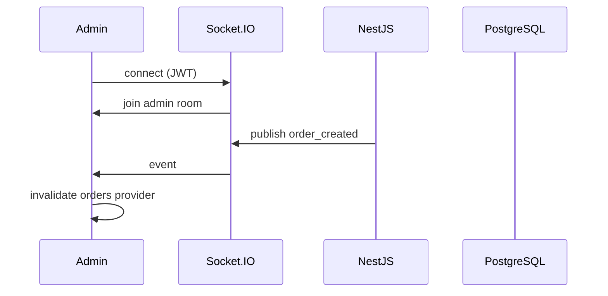

# Realtime Layer

## Backend

- **Gateway:** `RealtimeGateway` at namespace `/realtime`
- **Auth:** JWT in handshake `auth.token` or `query.token`
- **Rooms:**
  - `admin` — all staff roles
  - `partner:{userId}` — delivery partners
  - `order:{orderId}` — on-demand via `subscribe_order` message

### Event types

| Event | Trigger |
|-------|---------|
| `order_created` | New order placed |
| `order_updated` | Status change / delayed flag |
| `order_assigned` | Delivery assignment |
| `payment_failed` | Payment failure |
| `partner_location` | Location update |
| `stock_low` | Automation stock check |
| `notification_created` | Push/in-app notification |

Emit via `SocketRealtimeService.publish()`.

### Configuration

```env
REALTIME_ENABLED=true   # default true
CORS_ORIGINS=http://localhost:8081,...
```

## Frontend (Admin)

- **Service:** `lib/core/admin/admin_realtime.dart`
- **Package:** `socket_io_client`
- **Fallback:** If WS disconnects, existing polling continues (dashboard 20s, orders 15s, delivery 10s)
- **Invalidation:** Events invalidate relevant Riverpod providers

```env
REALTIME_URL=http://localhost:3000   # optional, derived from API_BASE_URL
REALTIME_ENABLED=true
```

## Flow



## Multi-instance

For production with multiple API pods, add `@socket.io/redis-adapter` so events broadcast across nodes.
